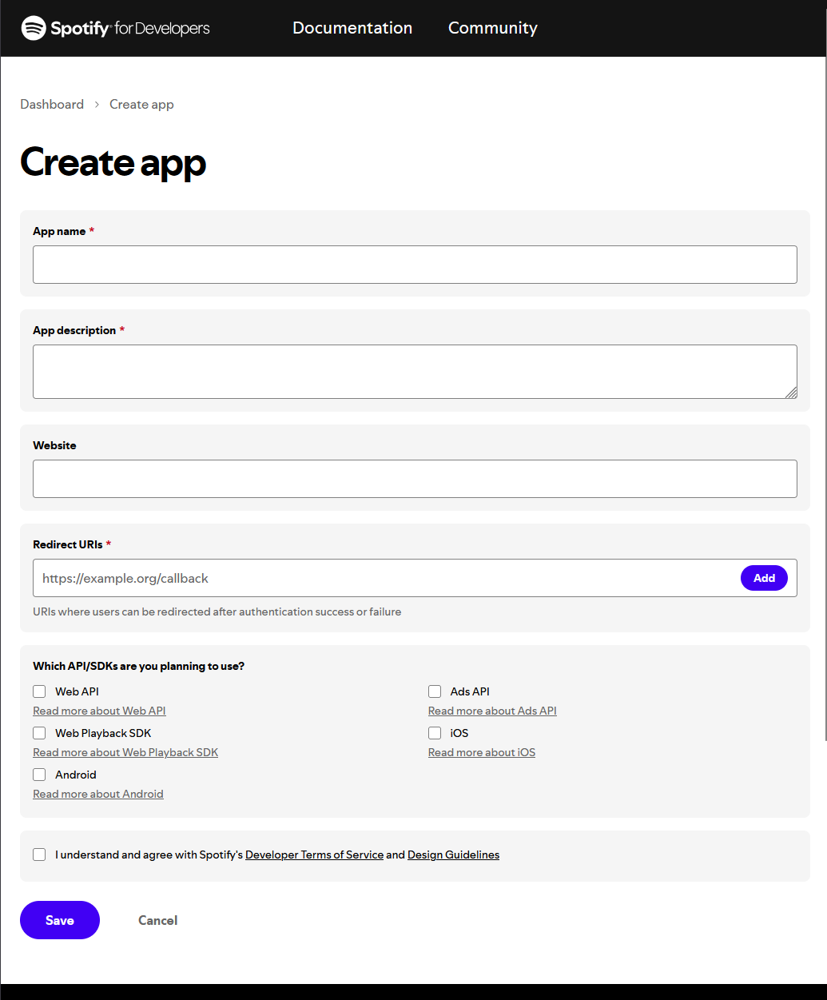
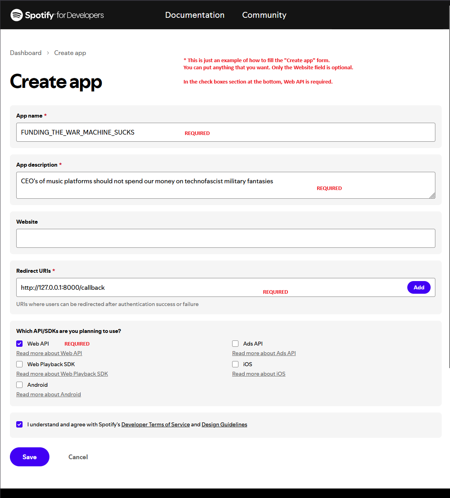
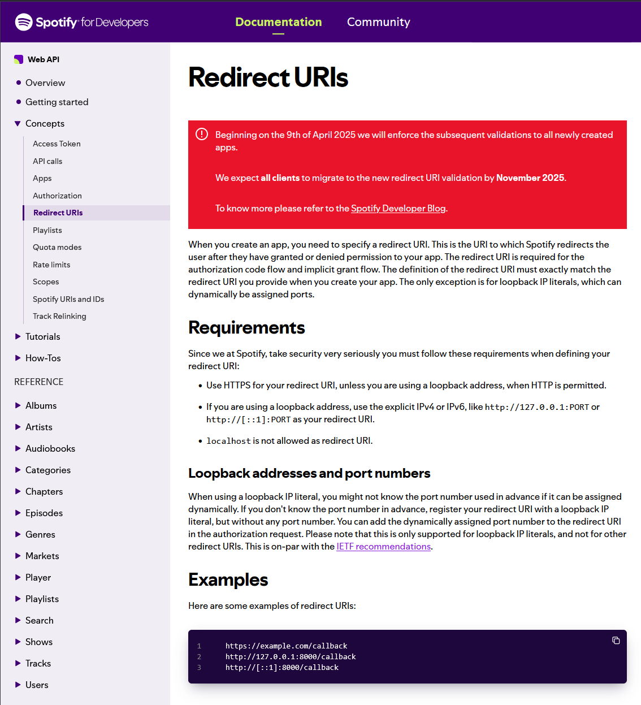

# Configuration de votre Compte Développeur Spotify

## Pourquoi un Compte Développeur Spotify est-il nécessaire ?

Ce script utilise la Web API de Spotify pour récupérer vos playlists.  
Pour accéder à l'API, vous devez vous authentifier via OAuth, ce qui nécessite :

- Un **Client ID** et un **Client Secret** du tableau de bord développeur Spotify.
- Un **Redirect URI** enregistré pour compléter le flux d'authentification en toute sécurité.

> **Note :** Votre compte développeur peut être le même que votre compte Spotify existant. Créer une application
> développeur **n'affecte pas** vos playlists ni l'utilisation de votre compte.

---

## Comment Créer votre Compte Développeur Spotify

### 1. Connectez-vous au tableau de bord développeur Spotify

- Rendez-vous sur [developer.spotify.com/dashboard](https://developer.spotify.com/dashboard)
- Cliquez sur **“Log In”** et connectez-vous avec vos identifiants Spotify.

---

### 2. Acceptez les Conditions Développeur

- Lors de votre première visite, Spotify vous demandera d'accepter les **Conditions d'utilisation pour développeurs**.
- Lisez-les et acceptez pour continuer.

---

### 3. Créez une Nouvelle Application

1. Cliquez sur **“Create an App”**.
2. Saisissez un **nom pour l'application** (ex. *My Playlists Exporter*).
3. Saisissez une **description pour l'application** (optionnel).
4. Acceptez les conditions pour développeurs si demandé.
5. Cliquez sur **“Create”**.

---

### 4. Obtenez votre Client ID et Client Secret

- Une fois l'application créée, vous verrez :
  - **Client ID** (visible immédiatement)
  - **Client Secret** (cliquez sur **“Show Client Secret”** pour l'afficher)

Copiez ces deux valeurs et ajoutez-les à votre fichier `.env`.

---

### 5. Configurez votre Redirect URI

1. Dans le tableau de bord de votre application, cliquez sur **“Edit Settings”**.
2. Sous **Redirect URIs**, ajoutez : <http://127.0.0.1:8888/callback> *(ou l'URI exact configuré dans votre `.env`)*.
3. Cliquez sur **Save**.

> **Pour plus d'informations :**  
> Consultez
> la [documentation officielle de Spotify sur les Redirect URIs](https://developer.spotify.com/documentation/web-api/concepts/redirect_uri)
> pour des détails complets.

---

## Prochaines étapes

✅ Votre compte développeur est prêt.  
✅ Modifiez votre fichier `.env` avec les valeurs correctes de *Client ID*, *Client Secret* et *Redirect URI*, puis
exécutez le script pour commencer à exporter vos playlists.

---

## Avertissement

Vos identifiants d'application développeur Spotify sont personnels.  
Ne partagez jamais publiquement votre Client Secret et ne l'ajoutez pas à un système de versionnage.

## Avis sur la Marque Déposée

Spotify est une marque déposée de Spotify AB.  
Ce projet **n'est ni affilié, ni sponsorisé, ni approuvé par Spotify** de quelque manière que ce soit.  
Toutes les références à Spotify sont faites uniquement à titre informatif et éducatif.

Les captures d'écran ou images utilisées dans cette documentation sont uniquement à des fins d'illustration pour aider
les utilisateurs à configurer leur compte développeur et n'impliquent aucune association avec Spotify AB.
